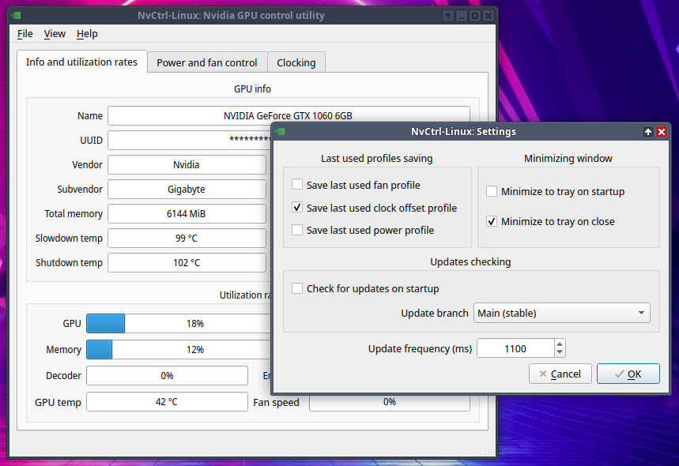

# NvCtrl-Linux (previous GWEpp)
Simple and lightweight utility for control Nvida GPU on GNU/Linux

* Written in C++ and Qt for performance and lightweight
* No other extra dependencies such as Python and XNvCtrlLib (works in Wayland)




## Installation
* Download source code of [latest release](https://codeberg.org/AlexCr4ckPentest/NvCtrl-linux/releases/latest)
* Download AppImage file of [latest release](https://codeberg.org/AlexCr4ckPentest/NvCtrl-linux/releases/latest)

### Building from sources
#### Build dependencies
##### Default (native build) for GNU/Linux
* C++ compiler: (GCC or LLVM Clang) with C++17 support
* CMake and Make
* Qt5 package (Qt5Core, Qt5Widgets, Qt5Gui, Qt5DBus)
* Nvidia drivers 510.XX or later (NVML required)
##### Additional dependencies for AppImage builds
* appimagetool: utility for creating AppImage builds
##### Additional dependencies for Win32 builds
* MinGW C++ compiler with C++17 support
* Qt5 binaries for win32 platform (must locate in /usr/x86_64-w64-mingw32/bin/)
* Locally installed Nvidia CUDA Toolkit (only NVML required)
#### Building steps
```
$ git clone --recurse-submodules https://codeberg.org/AlexCr4ckPentest/NvCtrl-linux
$ cd NvCtrl-linux
$ ./build.sh
```
#### To install executable in system, run:
``` $ sudo ./install.sh ```
